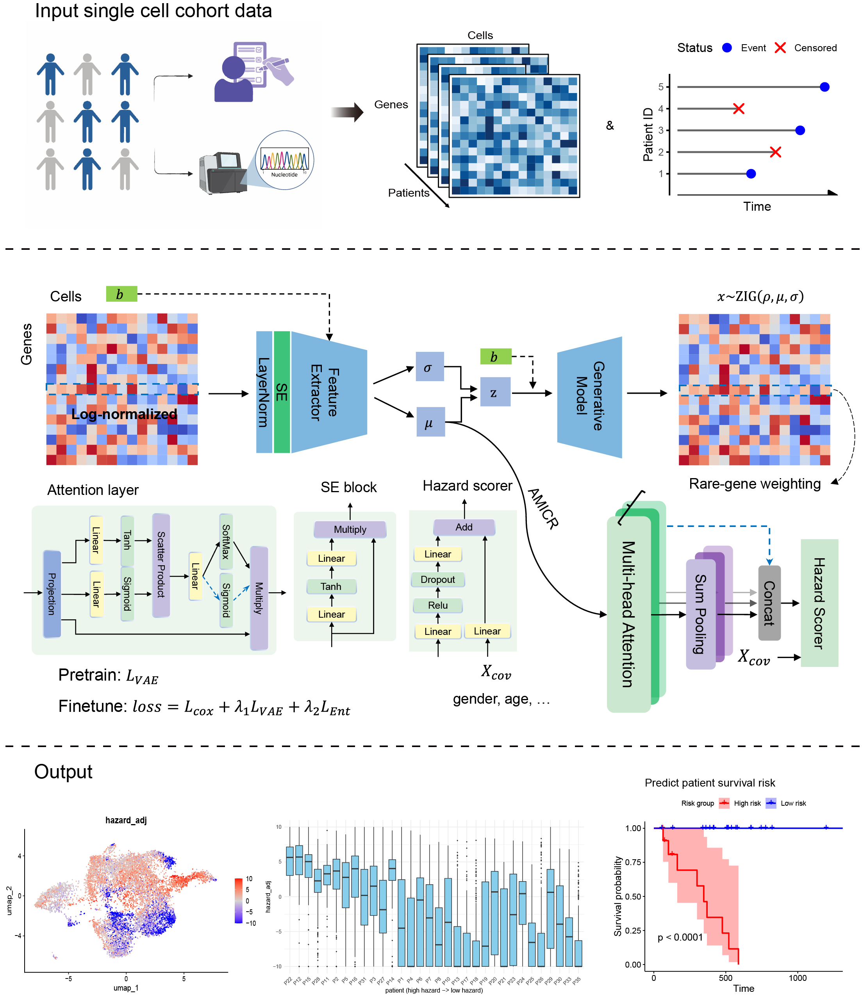

# scSurvial: survival analysis from single-cell cohort data at cellular resolution
## What is it

scSurvival is a new, scalable, and interpretable tool for modeling survival outcomes from single-cell cohort data, with cellular-resolution risk profiling. It first employs a feature extraction module based on a variational autoencoder and generative modeling to learn batch-invariant single-cell representations, and then aggregates cell-level features to the patient level to perform multi-head attention-based multiple instance Cox regression. scSurvival not only enables the integration of single-cell expression data with patient-level clinical variables to build accurate survival risk prediction models, but also identifies key cell subpopulations most associated with survival risk and characterizes their risk tendencies, thereby facilitating more refined downstream analyses. The framework of scSurvival is depicted in the following figure:

<p align="center">
  
</p>

## News 
* May, 2025: scSurvival version 1.2.0 is launched. It now supports joint analysis incorporating patient covariates.
* April, 2025: scSurvival version 1.1.0 is launched. It has added support for handling batch effects in single-cell data.
* March, 2025: scSurvival version 1.0.0 is launched.


## System Requirements
### Hardware requirements
`scSurvival` package is based on the deep learning framework Pytorch. Therefore, it is best to use scSurvival on a standard computer with a GPU that has enough VRAM.

The following runtimes are generated using a computer with 64GB RAM, 24 cores @ up to 5.6 GHz CPU, RTX4090 Laptop GPU (16GB VRAM).

### Software requirements
#### OS Requirements
The developmental version of the package has been tested on the following systems:
+ Windows
+ MacOS
+ Linux 
  
#### Python Dependencies
`scSurvival` depends on the following Python packages:
    torch 2.4.0+cu124
    numpy 1.26.4
    pandas 2.2.2
    scanpy 1.10.2
    scikit-learn 1.4.2
    lifelines 0.30.0

## How to install
scSurvival is developed under Python(version >= 3.11.9). To build scSurvival, clone the repository:

    git clone https://github.com/cliffren/scSurvival.git
    cd scSurvival

Then install the scSurvival package by pip, and all requirements will be installed automatically.

    pip install -e .
You can also install the dependency packages manually, especially for the **GPU** version of pytorch, which is automatically installed for the CPU version. 

## Quick start in python
```python
from scSurvival import scSurvivalRun, PredictIndSample
import scanpy as sc
import numpy as np
import pandas as pd

# prepare data source
## single data cohort
expression_data = np.random.rand(5000, 2000) # 5000 cells and 2000 genes.
sample_ids = np.random.randint(0, 30, 5000)
batch_ids = np.random.randint(0, 3, 5000) # (optional)
adata = sc.AnnData(
  expression_data, 
  obs={'sample': sample_ids, 'batch': batch_ids}
  )
### preprocess adata to log1p-normalized data. 

## clinic survival data
surv_time = np.random.randint(1, 100, 30) 
surv_status = np.random.randint(0, 2, 30)
surv = pd.DataFrame(
  {'time': surv_time, 'status': surv_status}, 
  index=np.arange(30)
  )

## clinic covariates data (optional)
covariates = np.random.randint(0, 2, (30, 2)) 
covariates = pd.DataFrame(
  covariates, 
  columns=[ 'age_group', 'gender'], 
  index=surv.index
  )
covariates = covariates.astype(str)  

# Perform scSurvival
adata, surv, model = scSurvivalRun(
    adata, 
    sample_column='sample',
    batch_key='batch', # (optional)
    surv=surv,
    covariates=covariates, # (optional)
    feature_flavor='AE', # AE | PCA
    entropy_threshold=0.7,
    fitnetune_strategy='jointly'# jointly | alternating | alternating_lightly
    )

## visualization of results
sc.pl.umap(adata, color=['attention'], vmin=0, vmax=1, cmap='coolwarm')
sc.pl.umap(adata_new, color=['hazard_adj'], cmap='coolwarm', vmin=-10, vmax=10)

# Predict on an independent sample
## For direct prediction, batch cannot be included in the training. If there is a batch effect, transfer learning can be performed by putting the test samples into adata for joint training.
adata_new, patient_hazard = PredictIndSample(
    adata_new, 
    adata=adata, 
    model=model, 
    covariates_new=covariates_new # (optional)
    )
```

## Examples & Tutorials
Using two simulation examples, we demonstrate how to execute scSurvival analysis. <br>
The two simulated datasets were generated in R. If you work in R, you can start directly here:

+ [scSurvival Tutorial in R](https://cliffren.github.io/scSurvival/examples/scSurvival_Tutorial_in_R.html)

If you prefer to run scSurvial directly in python, you can also download our simulation data and start here, 
+ [scSurvival Tutorial in Python](https://github.com/cliffren/scSurvival/blob/main/examples/scSurvival_Tutorial_in_Python.ipynb)

The R tutorial or python tutorial would take about 5 minutes on the test computer using GPU (58 minutes using CPU only). 

## How to Cite scSurvival
Please cite the following manuscript:

>scSurvial: survival analysis from single-cell cohort data at cellular resolution. https://doi.org/xxx. <br>
Tao Ren, Faming Zhao, Canping Chen, Ling-Yun Wu and Zheng Xia

## License
scSurvival is licensed under the GNU General Public License v3.0. <br>
scSurvival will be updated frequently with new features and improvements. If you have any questions, please submit them on the [GitHub issues page](https://github.com/cliffren/scSurvival/issues) or check the [FAQ](https://cliffren.github.io/scSurvival/examples/FAQ/scSurvival_FAQ.html) list.


